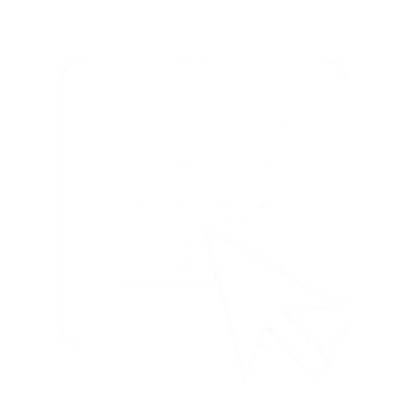
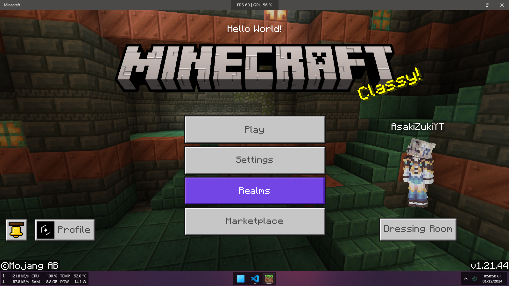

# JsonUI Scripting



<p><b>JsonUI Scripting</b> is an open-source library that uses the JavaScript programming language to build a JsonUI pack with class structures that make it easy to manipulate and edit the UI of <b>Minecraft: Bedrock Edition.</b></p>

<p>This library also includes a built-in <b>Binding compiler</b>, enabling the use of operators and functions that JsonUI lacks, making binding code more convenient and easier to code!</p>

# Installation

<p>To install it into your project, you need to have <b>Node.js</b> pre-installed to use it!</p>

<p>You also need to create a project and use the following command to start using <b>JsonUI Scripting</b>:</p>

```batch
npm install jsonui-scripting
```

<p>That command will add the JsonUI Scripting library to your project, and you can start using it.</p>

# How to use

<p>The syntax is very simple. If you just want to display the text "Hello World" on the main screen, here is the code for that:</p>

```javascript
const { UI, Vanilla, Anchor } = require("jsonui-scripting");

const label = UI.label({
	text: "Hello World!",
	anchor: Anchor.TopMiddle,
	y: 15,
	layer: 50,
});

Vanilla.start.startScreenContent().addChild(label);
```

<p>And you just need to run the code you wrote, and here is the result:</p>

<p align="center">
    
</p>
